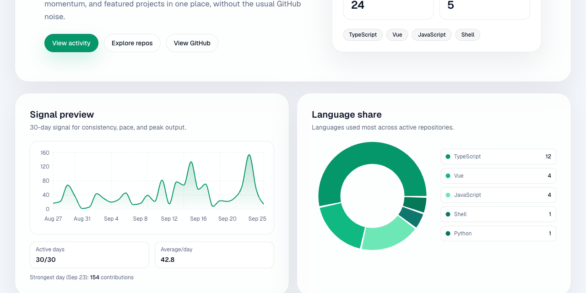

# GitHub Commit Dashboard

<div align="center">


<a href="https://github.com/brandonperfetti/github-commit-dashboard/actions/workflows/ci.yml"></a>

**Build turns a GitHub account into an engineering dashboard: 30-day contribution signal, PR and issue flow health, repository momentum and risk, and release cadence.**

[Live Demo](https://github.brandonperfetti.com) · [Report Bug](https://github.com/brandonperfetti/github-commit-dashboard/issues)

</div>



## What it shows

| Route       | Charts and panels                                                                                                                                                                                                                                                                                |
| ----------- | ------------------------------------------------------------------------------------------------------------------------------------------------------------------------------------------------------------------------------------------------------------------------------------------------ |
| `/`         | 30-day contribution trend · language share · pinned and recently shipped repositories                                                                                                                                                                                                            |
| `/activity` | 30-day contribution heatmap with weekly totals and streaks · PR cycle time (median open-to-merge hours) · PR flow health (merge and reopen rates) · issue flow health (opened vs closed, net backlog) · commit timing heatmap (weekday × hour, timezone-aware) · PR throughput · daily breakdown |
| `/repos`    | pinned vs non-pinned momentum · weekly commit cadence · repository risk panel (hot / active / stale / dormant) · browsable repository inventory                                                                                                                                                  |
| `/featured` | featured relevance score breakdown (pinned boost + stars + recency + 30-day commits) · monthly release cadence · featured project cards                                                                                                                                                          |

Every chart is a [Recharts](https://recharts.org/) component fed by server-side data shaping in [`lib/github.ts`](lib/github.ts). Data comes from the GitHub REST and GraphQL APIs, fetched in server components and cached with a five-minute revalidation window plus an on-demand revalidation endpoint. It is not real-time: there are no WebSockets or streaming updates.

---

## Tech Stack

| Technology                                                   | Purpose                                                     |
| ------------------------------------------------------------ | ----------------------------------------------------------- |
| [Next.js](https://nextjs.org/) 16 (App Router)               | React 19 server components, `"use cache"` route caching     |
| [TypeScript](https://www.typescriptlang.org/)                | Type safety throughout                                      |
| [Recharts](https://recharts.org/)                            | Charts, with a theme-aware palette from CSS variables       |
| [Tailwind CSS](https://tailwindcss.com/) v4                  | Utility-first styling                                       |
| [GSAP](https://gsap.com/)                                    | Headline and scroll-reveal motion (respects reduced motion) |
| [GitHub REST + GraphQL API](https://docs.github.com/en/rest) | Repositories, pinned items, commits, PRs, issues, releases  |
| [Lucide React](https://lucide.dev/)                          | Icon library                                                |
| [Vitest](https://vitest.dev/)                                | Unit and smoke tests                                        |

Dark and light mode use a small custom theme provider (cookie plus `localStorage`, system-aware) rather than a library.

---

## Getting Started

### Prerequisites

- [Node.js](https://nodejs.org/) v20.9+ (CI runs on 24)
- [npm](https://www.npmjs.com/) or compatible package manager
- A [GitHub token](https://github.com/settings/tokens) (fine-grained with repository read access is preferred; classic with `public_repo` also works)

### Installation

```bash
git clone https://github.com/brandonperfetti/github-commit-dashboard.git
cd github-commit-dashboard
npm install
```

### Environment Variables

Create a `.env.local` file in the project root:

```env
GITHUB_TOKEN=your_github_personal_access_token
NEXT_PUBLIC_SITE_URL=http://localhost:3000
REVALIDATE_SECRET=replace_with_a_long_random_secret
```

> **Note:** The `GITHUB_TOKEN` is used server-side only and is never exposed to the client.
> **Note:** `NEXT_PUBLIC_SITE_URL` is required for production builds and metadata URLs.
> **Note:** `REVALIDATE_SECRET` secures on-demand cache invalidation (`POST /api/revalidate`).
> **Note:** The dashboard's GitHub username is the `USERNAME` constant in `lib/github.ts`; change it there to point the dashboard at another account.

### Development

```bash
npm run dev
```

Open [http://localhost:3000](http://localhost:3000) to view the dashboard.

## GitHub API Auth (Recommended)

This dashboard can run against anonymous GitHub API limits, but you will hit `403` rate limits more often during local development.

Add a token in `.env.local`:

```bash
GITHUB_TOKEN=github_pat_...
ALLOWED_DEV_ORIGINS=192.168.1.156
```

Notes:

- Keep it server-side only (do not prefix with `NEXT_PUBLIC_`).
- `ALLOWED_DEV_ORIGINS` accepts a comma-separated list for local device testing (for example, `192.168.1.156,192.168.1.200`).
- Fine-grained token with read access to repositories is preferred.
- With a token present, the app uses authenticated `/user/repos` calls and can include private repositories you can access, and it reads your pinned repositories over GraphQL.
- Without a token, it falls back to public `/users/{username}/repos` and skips pinned repositories.

### Testing

```bash
npm test
```

The suite runs on [Vitest](https://vitest.dev/) with no network access: every GitHub request goes through a fetch router in `tests/helpers`, and any unrouted request fails the test. It covers the data shaping behind the charts (streaks, calendar weeks, weekly and monthly windows, cycle-time medians, merge rates, timezone bucketing, risk buckets), the GitHub client's pagination and fallbacks, the URL and timezone helpers, and a smoke render of the home route from stubbed API responses, including the case where every upstream call fails. `npm run test:watch` keeps it running while you work.

### Production Build

```bash
npm run build
npm run start
```

### Environment Validation

```bash
npm run validate:env -- --mode=production
```

This checks required production variables (currently `NEXT_PUBLIC_SITE_URL`) and fails fast when missing or malformed.

### On-Demand Cache Revalidation

Trigger targeted cache invalidation (by tag and/or path):

```bash
curl -X POST http://localhost:3000/api/revalidate \
  -H "Content-Type: application/json" \
  -H "x-revalidate-secret: $REVALIDATE_SECRET" \
  -d '{
    "tags": ["route:activity", "github:commit-timing"],
    "paths": ["/activity"]
  }'
```

Supported payload fields:

- `tags`: cache tags set via `cacheTag(...)`
- `paths`: route paths for `revalidatePath(...)`

Security notes:

- The endpoint requires `REVALIDATE_SECRET`.
- Secret can be passed via `x-revalidate-secret` or `Authorization: Bearer ...`.
- Tags must match `^[a-z0-9:_-]{2,64}$`; paths must begin with `/`.

### Revalidate via GitHub Actions

Use the `Revalidate Cache` workflow (`.github/workflows/revalidate-cache.yml`) to trigger invalidation from the Actions UI:

1. Open **Actions** → **Revalidate Cache** → **Run workflow**
2. Select `Preview` or `Production`
3. Optionally override `base_url`
4. Provide comma-separated `tags_csv` and `paths_csv`

The workflow calls `POST /api/revalidate` with `REVALIDATE_SECRET`.

### Scheduled Cache Warm-Up

The `Warm Route Cache` workflow (`.github/workflows/warm-route-cache.yml`) runs every 15 minutes and pings key routes (`/`, `/activity`, `/repos`, `/featured`) to reduce cold-cache first-load latency.

You can also run it manually from Actions and override:

- `target_environment` (`Preview` or `Production`)
- `base_url`
- `routes_csv`

### Linting

```bash
npm run lint
```

### Continuous Integration

- `CI` (`.github/workflows/ci.yml`) runs lint, the Prettier check, and the test suite on every pull request and on pushes to `main` and `develop`.
- `Env Guard` (`.github/workflows/env-guard.yml`) validates the production environment variables.

---

## Project Structure

```
github-commit-dashboard/
├── app/
│   ├── activity/         # Contribution, PR/issue flow, and commit timing page
│   ├── api/
│   │   ├── activity/     # Commit timing heatmap endpoint (timezone query)
│   │   └── revalidate/   # Secret-guarded on-demand cache invalidation
│   ├── components/
│   │   ├── charts/       # Recharts components + theme-aware color hook
│   │   ├── motion/       # GSAP headline and scroll-reveal wrappers
│   │   └── ui/           # Badge, button, card primitives
│   ├── featured/         # Featured repositories page
│   ├── repos/            # Repository browser page
│   ├── layout.tsx        # Root layout with theme provider
│   └── page.tsx          # Dashboard home
├── lib/
│   ├── github.ts         # GitHub API client and all chart data shaping
│   ├── site-config.ts    # Public site URL resolution
│   ├── timezone.ts       # IANA timezone validation
│   └── url.ts            # Safe http(s) URL normalisation
├── tests/                # Vitest suite (fetch-stubbed, no network)
└── public/               # Static assets
```

---

## Deployment

This project is optimized for deployment on [Vercel](https://vercel.com/). Add `GITHUB_TOKEN`, `NEXT_PUBLIC_SITE_URL`, and `REVALIDATE_SECRET` as environment variables in the Vercel project settings.

[](https://vercel.com/new/clone?repository-url=https://github.com/brandonperfetti/github-commit-dashboard)

---

## License

MIT © [Brandon Perfetti](https://brandonperfetti.com)
